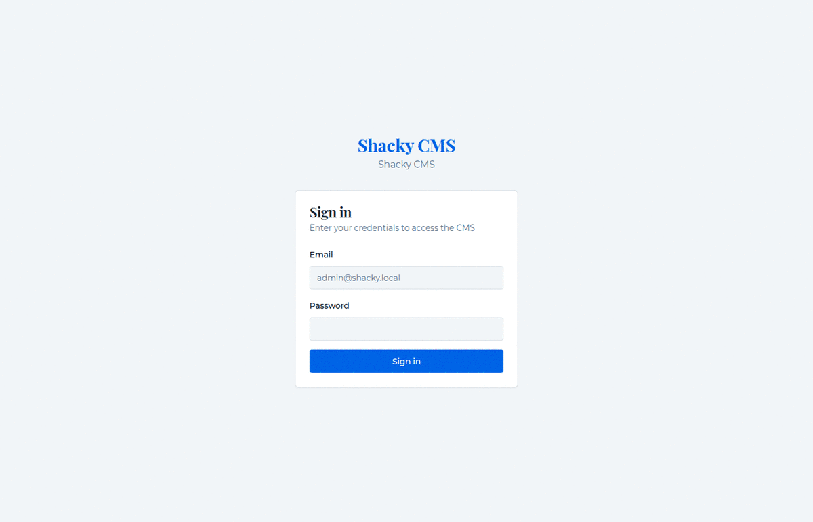

<div align="center">

# Shacky CMS

**A fast, self-hosted headless CMS built for modern publishing workflows.**  
Write → Ingest → Publish → Send — all in one place.

[](https://www.typescriptlang.org/)
[](https://fastify.dev/)
[](https://nextjs.org/)
[](https://prisma.io/)
[](https://www.docker.com/)
[](LICENSE)

</div>

---

## Demo



---

## What it does

| Feature | Description |
|---|---|
| **Rich editor** | TipTap-based editor with an AI writing panel, inline formatting, and image embeds |
| **DOCX ingest** | Upload a ZIP of `.docx` files — articles are parsed, images extracted, and AI enhancements queued automatically |
| **AI pipeline** | Provider-agnostic: OpenAI, Gemini, Ollama, or Groq — auto-categorisation, tag generation, featured image creation / stock image search |
| **Issues & campaigns** | Group posts into magazine-style issues, then send them as email or WhatsApp campaigns to subscriber lists |
| **Subscribers & forms** | Embeddable forms that feed entries directly into subscriber lists; email + WhatsApp channels |
| **MCP server** | Expose your CMS to AI agents via the [Model Context Protocol](https://modelcontextprotocol.io/) with full OAuth2 + PKCE |
| **n8n automation** | Ready-made workflow: Gmail → ingest → publish → campaign, zero manual steps |
| **WordPress sync** | Publish posts to a WordPress site from the same CMS |
| **Webhooks** | Outbound events on post publish, configurable per integration |
| **Media library** | All uploads in MinIO/S3; stock photo search built in |

---

## Stack

```
┌─ apps/web   Next.js 14 (App Router) · Tailwind CSS · shadcn/ui · TipTap · SWR
├─ apps/api   Fastify · Prisma · BullMQ · Zod · JWT + TOTP 2FA
├─ packages/  Shared TypeScript types & utilities
└─ infra      PostgreSQL 16 · Redis 7 · MinIO
```

---

## Quick start

### Option A — Docker (full stack)

```bash
cp .env.example .env          # fill in JWT_ACCESS_SECRET, JWT_REFRESH_SECRET, APP_URL
docker compose up --build
```

App is at **http://localhost:3000** · API at **http://localhost:4000**

### Option B — Local dev (recommended for development)

**1. Start infrastructure**
```bash
docker compose up postgres redis minio minio_init -d
```

**2. Install dependencies**
```bash
pnpm install
```

**3. Configure environment**
```bash
cp .env.example apps/api/.env
cp .env.example apps/web/.env.local
# Edit both files — minimum required: DATABASE_URL, REDIS_URL, JWT_*_SECRET, APP_URL
```

**4. Run migrations & seed**
```bash
pnpm db:migrate
pnpm db:seed
```

**5. Start everything**
```bash
pnpm dev          # api :4000 + web :3000 in parallel
```

> **Never use `prisma db push`.** The Docker entrypoint runs `prisma migrate deploy` which only applies migration files. Always use `pnpm db:migrate` for schema changes.

---

## Environment variables

| Variable | Required | Default | Notes |
|---|---|---|---|
| `DATABASE_URL` | ✅ | — | PostgreSQL connection string |
| `REDIS_URL` | ✅ | `redis://localhost:6379` | |
| `JWT_ACCESS_SECRET` | ✅ | — | ≥ 32 chars |
| `JWT_REFRESH_SECRET` | ✅ | — | ≥ 32 chars |
| `APP_URL` | ✅ | `http://localhost:3000` | Public Next.js URL (used in OAuth metadata) |
| `API_URL` | — | `http://localhost:4000` | Internal API address (container-to-container) |
| `S3_*` | — | MinIO defaults | Object storage |
| `EMAIL_PROVIDER` | — | `resend` | `resend` or `smtp` |
| `RESEND_API_KEY` | — | — | If using Resend |

AI keys, Botsab credentials, and stock-photo API keys are stored in the **Settings** table at runtime — not in `.env`.

---

## Key commands

```bash
pnpm dev                          # start api + web in watch mode
pnpm build                        # shared → api → web
pnpm typecheck                    # tsc --noEmit across all packages
pnpm db:migrate                   # create + apply migration (always use this)
pnpm db:studio                    # open Prisma Studio
pnpm db:seed                      # seed initial data
```

---

## DOCX ingest pipeline

```
Upload ZIP  →  Phase 1 (sync): parse DOCX, create Posts, upload images to MinIO
            →  Phase 2 (async, BullMQ): AI categorisation · tag generation
                                         · featured image gen / stock search
            →  Poll GET /api/ingest/jobs/:jobId for completion
```

---

## MCP (AI agent access)

Claude and other MCP-compatible agents can connect to your CMS directly.

**Endpoint:** `https://your-domain.com/mcp`

The server implements full OAuth2 with PKCE and dynamic client registration (RFC 7591 / 8414 / 9728). In Claude's connector settings, paste your domain's MCP URL — the authorization flow handles the rest.

**Available tools:**

| Scope | Tools |
|---|---|
| `posts:read` | `get_site_info` · `list_posts` · `get_post` · `list_categories` · `list_tags` · `get_stats` · `list_authors` · `list_issues` · `get_issue` · `list_pages` |
| `posts:write` | `create_post` · `update_post` · `create_issue` · `assign_posts_to_issue` · `publish_issue` · `create_category` · `create_tag` · `create_page` · `update_page` |
| `media:read` | `list_media` · `search_stock_images` · `set_post_featured_image_from_stock` |
| `subscribers:read` | `list_subscribers` · `list_subscriber_lists` |
| `campaigns:read` | `list_campaigns` |
| `campaigns:write` | `create_campaign` · `send_campaign_test` · `send_campaign` |

Manage active tokens at **Admin → Integrations → MCP Access**.

---

## n8n automation

A ready-to-import workflow lives in [`n8n/mail-publishing.json`](n8n/mail-publishing.json).

**Flow:** Inbox trigger (Gmail) → compress attachments → preview issue → fetch latest issue → create next issue → ingest articles → bulk-publish → create campaign → test-send → mark email as read.

**To use:**
1. Import the JSON into your n8n instance
2. Replace the four placeholders:
   - `YOUR_APPLICATION_PASSWORD` — create one in Admin → Integrations → Application Passwords
   - `YOUR_GMAIL_CREDENTIAL_ID` — your n8n Gmail OAuth2 credential
   - `YOUR_CMS_DOMAIN` — e.g. `https://your-cms.example.com`
   - `YOUR_SUBSCRIBER_LIST_ID` — find it in Admin → Subscribers → Lists

---

## Roles

| Role | Can do |
|---|---|
| `superadmin` | Everything, including settings and user management |
| `editor` | Create / edit / publish any post; manage media |
| `author` | Create and edit own posts |
| `subscriber_manager` | Manage subscribers and campaigns only |

---

## Architecture

```
Browser
  └── Next.js :3000
        ├── /api/*          → proxy → Fastify :4000
        ├── /mcp            → proxy → Fastify :4000/mcp
        ├── /oauth/token    → proxy → Fastify :4000
        ├── /oauth/register → proxy → Fastify :4000
        ├── /oauth/revoke   → proxy → Fastify :4000
        ├── /.well-known/*  → proxy → Fastify :4000
        └── /s3/*           → proxy → MinIO :9000

Fastify :4000
  ├── Routes     /api/{posts,issues,campaigns,forms,subscribers,media,...}
  ├── Services   ai · email · docxIngestion · botsab · newsletter · wordpress
  ├── Workers    scheduler (60s) · ingestWorker (BullMQ)
  └── Plugins    prisma · redis · auth
```

---

## Contributing

1. Fork & clone
2. `pnpm install`
3. Follow **Option B** above
4. Create a feature branch, open a PR against `main`

---

<div align="center">
  Built with ☕ · Powered by Fastify, Next.js, and Prisma
</div>
